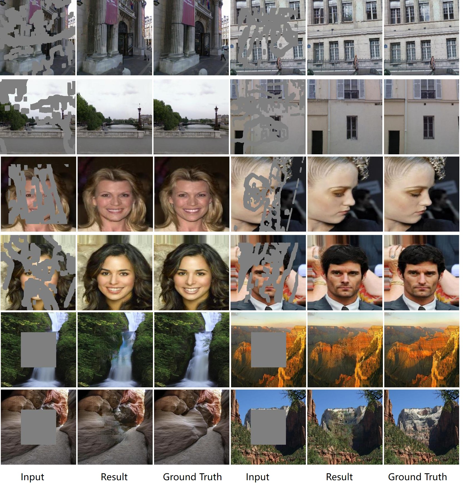
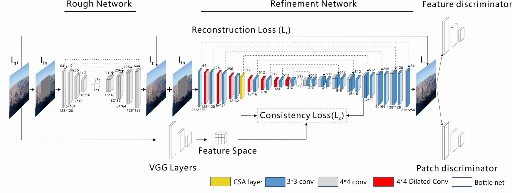
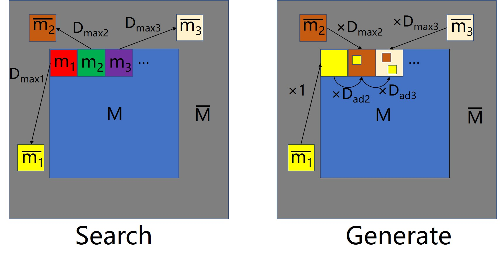
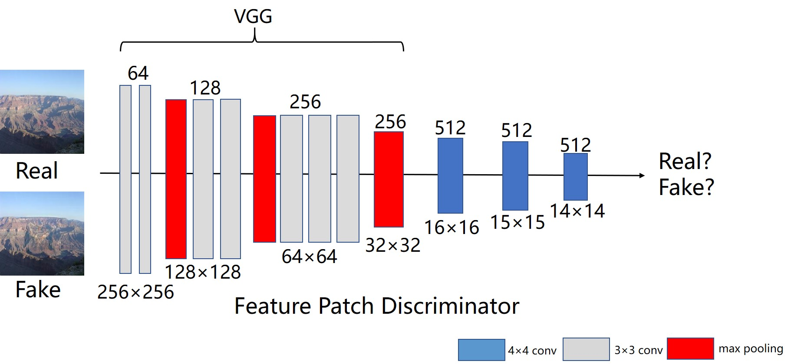

# Coherent Semantic Attention for image inpainting (ICCV 2019)
[Arxiv](https://arxiv.org/abs/1905.12384) |[ICCV 2019 paper](http://openaccess.thecvf.com/content_ICCV_2019/papers/Liu_Coherent_Semantic_Attention_for_Image_Inpainting_ICCV_2019_paper.pdf)| [BibTex](#jump1)

-----------
## Introduction
The existing inpainting methods often generate contents with blurry textures and distorted structures due to the discontinuity of the local pixels.From a semantic-level perspective, the local pixel discontinuity is mainly because these methods ignore the semantic relevance and feature continuity of hole regions. To handle this problem, we investigate the human behavior in repairing pictures and propose a fined deep generative model-based approach with a novel coherent semantic attention (CSA) layer, which can not only preserve contextual structure but also make more effective predictions of missing parts by modeling the semantic relevance between the holes features. Meanwhile, we further propose consistency loss and feature patch discriminator to stabilize the network training process and improve the details. 
<div align=center></div>

-------------

## Model Architecture
<div align=center></div>

### CSA Architecture
<div align=center></div>

### Feature patch discriminator
<div align=center></div>


-------------

## Prerequisites
* Windows or Linux
* Python3
* Pytorch 1.0
* NVIDIA GPU + CUDA CuDNN.
* Jupyter Notebook

--------------

## Installation
* Clone this repo:
    ```
    git clone https://github.com/KumapowerLIU/CSA-inpainting.git
    cd CSA-inpainting
    ```

* Install PyTorch and dependencies from http://pytorch.org

* Or you can clone the repo and run by conda
    ```
    conda env create -f environment.yaml 
    conda activate csa-inpainting
    jupyter notebook
    ```
  Open the browser and enter the URL `http://localhost:8080` to enjoy jupyter notebook

--------------

## Datasets
We use [Places2](http://places2.csail.mit.edu/), [CelebA](http://mmlab.ie.cuhk.edu.hk/projects/CelebA.html) and [Paris Street-View](https://github.com/pathak22/context-encoder) datasets. To train a model on the full dataset, download datasets from official websites.

Our model is trained on the irregular mask dataset provided by [Liu et al](https://arxiv.org/abs/1804.07723). You can download publically available Irregular Mask Dataset from their [website](http://masc.cs.gmu.edu/wiki/partialconv).
## Model Training
* Download your own inpainting datasets.
* Open train.ipynb in Jupyter Notebook
* Modify Option Class to set data_root,mask_root,checkpoints_dir, mask_type and other parameters.
* Run train.ipynb
## Model Testing
* Open test.ipynb in Jupyter Notebook
* Keep the same parameters as during training
* Run test.ipynb

## License
CC 4.0 Attribution-NonCommercial International.
The software is for educaitonal and academic research purpose only.

## <span id="jump1">Citation</span>
```
@InProceedings{Liu_2019_CSA,
    Author = {Hongyu Liu and Bin Jiang and Yi Xiao and Chao Yang},
    Title = {Coherent Semantic Attention for Image Inpainting},
    booktitle = { IEEE International Conference on Computer Vision (ICCV)},
    month = {July},
    year = {2019}
    
}
```
## Acknowledgments
We benefit a lot from [Shift-net](https://github.com/Zhaoyi-Yan/Shift-Net_pytorch)
